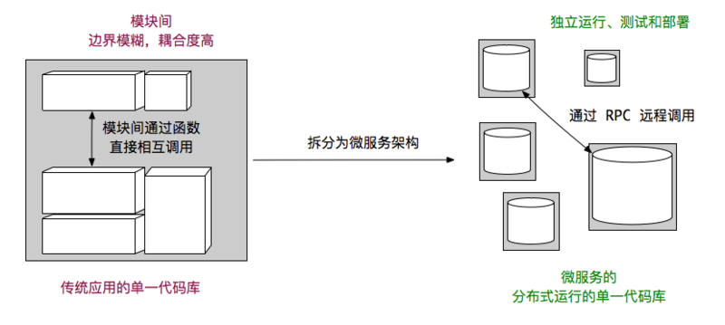
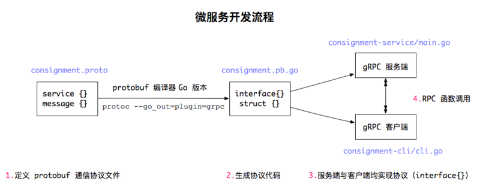
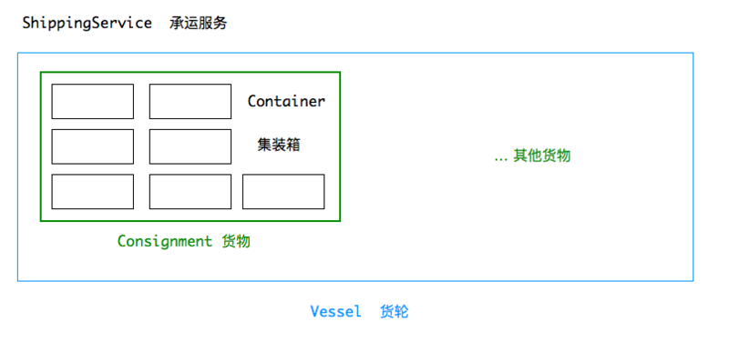

[Github Blog](https://github.com/wuYin/blog/tree/master/microservices)

---
title: Golang 微服务教程（一）
date: 2018-05-10 17:25:00
tags: 微服务
---


原文链接：[ewanvalentine.io](https://ewanvalentine.io/microservices-in-golang-part-1)，翻译已获作者授权。

本节对 gRPC 的使用浅尝辄止，更多可参考：[gRPC 中 Client 与 Server 数据交互的 4 种模式](https://github.com/wuYin/grpc-modes)

<!-- more -->

## 前言

### 系列概览

《Golang 微服务教程》分为 10 篇，总结微服务开发、测试到部署的完整过程。

本节先介绍微服务的基础概念、术语，再创建我们的第一个微服务 consignment-service 的简洁版。在接下来的第 2~10 节文章中，我们会陆续创建以下微服务：

- consignment-service（货运服务）
- inventory-service（仓库服务）
- user-service（用户服务）
- authentication-service（认证服务）
- role-service （角色服务）
- vessel-service（货船服务）

用到的完整技术栈如下：

```
Golang, gRPC, go-micro			// 开发语言及其 RPC 框架
Google Cloud, MongoDB			// 云平台与数据存储
Docker, Kubernetes, Terrafrom  	// 容器化与集群架构
NATS, CircleCI					// 消息系统与持续集成
```

### 代码仓库

作者代码：[EwanValentine/shippy](https://github.com/EwanValentine/shippy)，译者的中文注释代码： [wuYin/shippy](https://github.com/wuYin/shippy)

每个章节对应仓库的一个分支，比如本文part1 的代码在 [feature/part1](https://github.com/wuYin/shippy/tree/feature/part1)

### 开发环境

笔者的开发环境为 macOS，本文中使用了 make 工具来高效编译，Windows 用户需 [手动安装](http://gnuwin32.sourceforge.net/packages/make.htm)

```shell
$ go env		
GOARCH="amd64"	# macOS 环境
GOOS="darwin"	# 在第二节使用 Docker 构建 alpine 镜像时需修改为 linux
GOPATH="/Users/wuyin/Go"
GOROOT="/usr/local/go"
```


## 准备

掌握 Golang 的基础语法：推荐阅读谢大的[《Go Web 编程》](https://github.com/astaxie/build-web-application-with-golang)

安装 [gRPC / protobuf](https://grpc.io/docs/quickstart/go.html)

```shell
go get -u google.golang.org/grpc					# 安装 gRPC 框架
go get -u github.com/golang/protobuf/protoc-gen-go	# 安装 Go 版本的 protobuf 编译器
```


## 微服务

### 我们要写什么项目？

我们要搭建一个港口的货物管理平台。本项目以微服务的架构开发，整体简单且概念通用。闲话不多说让我们开始微服务之旅吧。

### 微服务是什么？

在传统的软件开发中，整个应用的代码都组织在一个单一的代码库，一般会有以下拆分代码的形式：

- 按照特征做拆分：如 MVC 模式
- 按照功能做拆分：在更大的项目中可能会将代码封装在处理不同业务的包中，包内部可能会再做拆分

不管怎么拆分，最终二者的代码都会集中在一个库中进行开发和管理，可参考：[谷歌的单一代码库管理](http://www.ruanyifeng.com/blog/2016/07/google-monolithic-source-repository.html)

微服务是上述第二种拆分方式的拓展，按功能将代码拆分成几个包，都是可独立运行的单一代码库。区别如下：



### 微服务有哪些优势？

#### 降低复杂性

将整个应用的代码按功能对应拆分为小且独立的微服务代码库，这不禁让人联想到 [Unix 哲学](https://en.wikipedia.org/wiki/Unix_philosophy)：Do One Thing and Do It Well，在传统单一代码库的应用中，模块之间是紧耦合且边界模糊的，随着产品不断迭代，代码的开发和维护将变得更为复杂，潜在的 bug 和漏洞也会越来越多。

#### 提高扩展性 

在项目开发中，可能有一部分代码会在多个模块中频繁的被用到，这种复用性很高的模块常常会抽离出来作为公共代码库使用，比如验证模块，当它要扩展功能（添加短信验证码登录等）时，单一代码库的规模只增不减， 整个应用还需重新部署。在微服务架构中，验证模块可作为单个服务独立出来，能独立运行、测试和部署。

遵循微服务拆分代码的理念，能大大降低模块间的耦合性，横向扩展也会容易许多，正适合当下云计算的高性能、高可用和分布式的开发环境。

**Nginx 有一系列文章来探讨微服务的许多概念，可 [点此阅读](https://www.nginx.com/blog/introduction-to-microservices/)**


### 使用 Golang 的好处？

微服务是一种架构理念而不是具体的框架项目，许多编程语言都可以实现，但有的语言对微服务开发具备天生的优势，Golang 便是其中之一

Golang 本身十分轻量级，运行效率极高，同时对并发编程有着原生的支持，从而能更好的利用多核处理器。内置 `net` 标准库对网络开发的支持也十分完善。可参考谢大的短文：[Go 语言的优势](https://www.zhihu.com/question/21409296/answer/18184584)

 此外，Golang 社区有一个很棒的开源微服务框架 [go-mirco](https://github.com/micro/go-micro)，我们在下一节会用到。


## Protobuf 与 gRPC

在传统应用的单一代码库中，各模块间可直接相互调用函数。但在微服务架构中，由于每个服务对应的代码库是独立运行的，无法直接调用，彼此间的通信就是个大问题，解决方案有 2 个：

### JSON 或 XML 协议的 API

微服务之间可使用基于 HTTP  的 JSON 或 XML 协议进行通信：服务 A 与服务 B 进行通信前，A 必须把要传递的数据 encode 成 JSON / XML 格式，再以字符串的形式传递给 B，B 接收到数据需要 decode 后才能在代码中使用：

- 优点：数据易读，使用便捷，是与浏览器交互必选的协议
- 缺点：在数据量大的情况下 encode、decode 的开销随之变大，多余的字段信息导致传输成本更高

### RPC 协议的 API

下边的 JSON 数据就使用 `description`、`weight` 等元数据来描述数据本身的意义，在 Browser / Server 架构中用得很多，以方便浏览器解析：

```json
{
  "description": "This is a test consignment",
  "weight": 550,
  "containers": [
    {
      "customer_id": "cust001",
      "user_id": "user001",
      "origin": "Manchester, United Kingdom"
    }
  ],
  "vessel_id": "vessel001"
}
```

但在两个微服务之间通信时，若彼此约定好传输数据的格式，可直接使用二进制数据流进行通信，不再需要笨重冗余的元数据。

#### gRPC 简介

[gRPC](https://grpc.io/) 是谷歌开源的轻量级 RPC 通信框架，其中的通信协议基于二进制数据流，使得 gRPC 具有优异的性能。

gRPC 支持 HTTP 2.0 协议，使用二进制帧进行数据传输，还可以为通信双方建立持续的双向数据流。可参考：[Google HTTP/2 简介](https://developers.google.com/web/fundamentals/performance/http2/?hl=zh-cn)

#### protobuf 作为通信协议

两个微服务之间通过基于 HTTP 2.0 二进制数据帧通信，那么如何约定二进制数据的格式呢？答案是使用 gRPC 内置的 protobuf 协议，其  [DSL](https://coolshell.cn/articles/5709.html) 语法 可清晰定义服务间通信的数据结构。可参考：[gRPC Go: Beyond the basics](https://blog.gopheracademy.com/advent-2017/go-grpc-beyond-basics/)


## consignment-service 微服务开发

经过上边必要的概念解释，现在让我们开始开发我们的第一个微服务：**consignment-service**

### 项目结构

假设本项目名为 **shippy**，你需要：

- 在 `$GOPATH` 的 src 目录下新建 shippy 项目目录
- 在项目目录下新建文件  `consignment-service/proto/consignment/consignment.proto`

为便于教学，我会把本项目的所有微服务的代码统一放在 shippy 目录下，这种项目结构被称为 "mono-repo"，读者也可以按照 "multi-repo" 将各个微服务拆为独立的项目。更多参考 [REPO 风格之争：MONO VS MULTI](https://zhuanlan.zhihu.com/p/31289463)

现在你的项目结构应该如下：

```
$GOPATH/src
    └── shippy
        └── consignment-service
            └── proto
                └── consignment
                    └── consignment.proto
```


### 开发流程

 

 

### 定义 protobuf 通信协议文件

```go
// shipper/consignment-service/proto/consignment/consignment.proto

syntax = "proto3";
package go.micro.srv.consignment;

// 货轮微服务
service ShippingService {
    // 托运一批货物
    rpc CreateConsignment (Consignment) returns (Response) {
    }
}

// 货轮承运的一批货物
message Consignment {
    string id = 1;                      // 货物编号
    string description = 2;             // 货物描述
    int32 weight = 3;                   // 货物重量
    repeated Container containers = 4;  // 这批货有哪些集装箱
    string vessel_id = 5;               // 承运的货轮
}

// 单个集装箱
message Container {
    string id = 1;          // 集装箱编号
    string customer_id = 2; // 集装箱所属客户的编号
    string origin = 3;      // 出发地
    string user_id = 4;     // 集装箱所属用户的编号
}

// 托运结果
message Response {
    bool created = 1;			// 托运成功
    Consignment consignment = 2;// 新托运的货物
}
```

语法参考： [Protobuf doc](https://developers.google.com/protocol-buffers/docs/reference/go-generated)



### 生成协议代码

#### protoc 编译器使用 grpc 插件编译 .proto 文件

为避免重复的在终端执行编译、运行命令，本项目使用 make 工具，新建 `consignment-service/Makefile` 

```makefile
build:
# 一定要注意 Makefile 中的缩进，否则 make build 可能报错 Nothing to be done for build
# protoc 命令前边是一个 Tab，不是四个或八个空格
	protoc -I. --go_out=plugins=grpc:$(GOPATH)/src/shippy/consignment-service proto/consignment/consignment.proto
```

执行 `make build`，会在 `proto/consignment` 目录下生成 `consignment.pb.go`

#### consignment.proto 与 consignment.pb.go 的对应关系

**service**：定义了微服务 ShippingService 要暴露为外界调用的函数：`CreateConsignment`，由 protobuf 编译器的 grpc 插件处理后生成 **interface**

```go
type ShippingServiceClient interface {
	// 托运一批货物
	CreateConsignment(ctx context.Context, in *Consignment, opts ...grpc.CallOption) (*Response, error)
}
```

**message**：定义了通信的数据格式，由 protobuf 编译器处理后生成 **struct**

```go
type Consignment struct {
	Id           string       `protobuf:"bytes,1,opt,name=id" json:"id,omitempty"`
	Description  string       `protobuf:"bytes,2,opt,name=description" json:"description,omitempty"`
	Weight       int32        `protobuf:"varint,3,opt,name=weight" json:"weight,omitempty"`
	Containers   []*Container `protobuf:"bytes,4,rep,name=containers" json:"containers,omitempty"`
    // ...
}
```


### 实现服务端

服务端需实现 `ShippingServiceClient` 接口，创建`consignment-service/main.go`

```go
package main

import (
    // 导如 protoc 自动生成的包
	pb "shippy/consignment-service/proto/consignment"
	"context"
	"net"
	"log"
	"google.golang.org/grpc"
)

const (
	PORT = ":50051"
)

//
// 仓库接口
//
type IRepository interface {
	Create(consignment *pb.Consignment) (*pb.Consignment, error) // 存放新货物
}

//
// 我们存放多批货物的仓库，实现了 IRepository 接口
//
type Repository struct {
	consignments []*pb.Consignment
}

func (repo *Repository) Create(consignment *pb.Consignment) (*pb.Consignment, error) {
	repo.consignments = append(repo.consignments, consignment)
	return consignment, nil
}

func (repo *Repository) GetAll() []*pb.Consignment {
	return repo.consignments
}

//
// 定义微服务
//
type service struct {
	repo Repository
}

//
// service 实现 consignment.pb.go 中的 ShippingServiceServer 接口
// 使 service 作为 gRPC 的服务端
//
// 托运新的货物
func (s *service) CreateConsignment(ctx context.Context, req *pb.Consignment) (*pb.Response, error) {
	// 接收承运的货物
	consignment, err := s.repo.Create(req)
	if err != nil {
		return nil, err
	}
	resp := &pb.Response{Created: true, Consignment: consignment}
	return resp, nil
}

func main() {
	listener, err := net.Listen("tcp", PORT)
	if err != nil {
		log.Fatalf("failed to listen: %v", err)
	}
	log.Printf("listen on: %s\n", PORT)

	server := grpc.NewServer()
	repo := Repository{}

    // 向 rRPC 服务器注册微服务
    // 此时会把我们自己实现的微服务 service 与协议中的 ShippingServiceServer 绑定
	pb.RegisterShippingServiceServer(server, &service{repo})

	if err := server.Serve(listener); err != nil {
		log.Fatalf("failed to serve: %v", err)
	}
}
```

上边的代码实现了 consignment-service 微服务所需要的方法，并建立了一个 gRPC 服务器监听 50051 端口。如果你此时运行 `go run main.go`，将成功启动服务端：


### 实现客户端

我们将要托运的货物信息放到 `consignment-cli/consignment.json`：

```json
{
  "description": "This is a test consignment",
  "weight": 550,
  "containers": [
    {
      "customer_id": "cust001",
      "user_id": "user001",
      "origin": "Manchester, United Kingdom"
    }
  ],
  "vessel_id": "vessel001"
}
```

客户端会读取这个 JSON 文件并将该货物托运。在项目目录下新建文件：`consingment-cli/cli.go`

```c
package main

import (
	pb "shippy/consignment-service/proto/consignment"
	"io/ioutil"
	"encoding/json"
	"errors"
	"google.golang.org/grpc"
	"log"
	"os"
	"context"
)

const (
	ADDRESS           = "localhost:50051"
	DEFAULT_INFO_FILE = "consignment.json"
)

// 读取 consignment.json 中记录的货物信息
func parseFile(fileName string) (*pb.Consignment, error) {
	data, err := ioutil.ReadFile(fileName)
	if err != nil {
		return nil, err
	}
	var consignment *pb.Consignment
	err = json.Unmarshal(data, &consignment)
	if err != nil {
		return nil, errors.New("consignment.json file content error")
	}
	return consignment, nil
}

func main() {
	// 连接到 gRPC 服务器
	conn, err := grpc.Dial(ADDRESS, grpc.WithInsecure())
	if err != nil {
		log.Fatalf("connect error: %v", err)
	}
	defer conn.Close()

	// 初始化 gRPC 客户端
	client := pb.NewShippingServiceClient(conn)

	// 在命令行中指定新的货物信息 json 文件
	infoFile := DEFAULT_INFO_FILE
	if len(os.Args) > 1 {
		infoFile = os.Args[1]
	}

	// 解析货物信息
	consignment, err := parseFile(infoFile)
	if err != nil {
		log.Fatalf("parse info file error: %v", err)
	}

	// 调用 RPC
	// 将货物存储到我们自己的仓库里
	resp, err := client.CreateConsignment(context.Background(), consignment)
	if err != nil {
		log.Fatalf("create consignment error: %v", err)
	}

	// 新货物是否托运成功
	log.Printf("created: %t", resp.Created)
}
```

运行 `go run main.go` 后再运行 `go run cli.go`：


我们可以新增一个 RPC 查看所有被托运的货物，加入一个`GetConsignments`方法，这样，我们就能看到所有存在的`consignment`了：

```protobuf
// shipper/consignment-service/proto/consignment/consignment.proto

syntax = "proto3";

package go.micro.srv.consignment;

// 货轮微服务
service ShippingService {
    // 托运一批货物
    rpc CreateConsignment (Consignment) returns (Response) {
    }
    // 查看托运货物的信息
    rpc GetConsignments (GetRequest) returns (Response) {
    }
}

// 货轮承运的一批货物
message Consignment {
    string id = 1;                      // 货物编号
    string description = 2;             // 货物描述
    int32 weight = 3;                   // 货物重量
    repeated Container containers = 4;  // 这批货有哪些集装箱
    string vessel_id = 5;               // 承运的货轮
}

// 单个集装箱
message Container {
    string id = 1;          // 集装箱编号
    string customer_id = 2; // 集装箱所属客户的编号
    string origin = 3;      // 出发地
    string user_id = 4;     // 集装箱所属用户的编号
}

// 托运结果
message Response {
    bool created = 1;                       // 托运成功
    Consignment consignment = 2;            // 新托运的货物
    repeated Consignment consignments = 3;  // 目前所有托运的货物
}

// 查看货物信息的请求
// 客户端想要从服务端请求数据，必须有请求格式，哪怕为空
message GetRequest {
}
```

现在运行`make build`来获得最新编译后的微服务界面。如果此时你运行`go run main.go`，你会获得一个类似这样的错误信息:


熟悉Go的你肯定知道，你忘记实现一个`interface`所需要的方法了。让我们更新`consignment-service/main.go`:

```go
package main

import (
	pb "shippy/consignment-service/proto/consignment"
	"context"
	"net"
	"log"
	"google.golang.org/grpc"
)

const (
	PORT = ":50051"
)

//
// 仓库接口
//
type IRepository interface {
	Create(consignment *pb.Consignment) (*pb.Consignment, error) // 存放新货物
	GetAll() []*pb.Consignment                                   // 获取仓库中所有的货物
}

//
// 我们存放多批货物的仓库，实现了 IRepository 接口
//
type Repository struct {
	consignments []*pb.Consignment
}

func (repo *Repository) Create(consignment *pb.Consignment) (*pb.Consignment, error) {
	repo.consignments = append(repo.consignments, consignment)
	return consignment, nil
}

func (repo *Repository) GetAll() []*pb.Consignment {
	return repo.consignments
}

//
// 定义微服务
//
type service struct {
	repo Repository
}

//
// 实现 consignment.pb.go 中的 ShippingServiceServer 接口
// 使 service 作为 gRPC 的服务端
//
// 托运新的货物
func (s *service) CreateConsignment(ctx context.Context, req *pb.Consignment) (*pb.Response, error) {
	// 接收承运的货物
	consignment, err := s.repo.Create(req)
	if err != nil {
		return nil, err
	}
	resp := &pb.Response{Created: true, Consignment: consignment}
	return resp, nil
}

// 获取目前所有托运的货物
func (s *service) GetConsignments(ctx context.Context, req *pb.GetRequest) (*pb.Response, error) {
	allConsignments := s.repo.GetAll()
	resp := &pb.Response{Consignments: allConsignments}
	return resp, nil
}

func main() {
	listener, err := net.Listen("tcp", PORT)
	if err != nil {
		log.Fatalf("failed to listen: %v", err)
	}
	log.Printf("listen on: %s\n", PORT)

	server := grpc.NewServer()
	repo := Repository{}
	pb.RegisterShippingServiceServer(server, &service{repo})

	if err := server.Serve(listener); err != nil {
		log.Fatalf("failed to serve: %v", err)
	}
}
```

如果现在使用`go run main.go`，一切应该正常：


最后让我们更新`consignment-cli/cli.go`来获得`consignment`信息：

```go
func main() {
    ... 

	// 列出目前所有托运的货物
	resp, err = client.GetConsignments(context.Background(), &pb.GetRequest{})
	if err != nil {
		log.Fatalf("failed to list consignments: %v", err)
	}
	for _, c := range resp.Consignments {
		log.Printf("%+v", c)
	}
}
```

此时再运行`go run cli.go`，你应该能看到所创建的所有`consignment`，多次运行将看到多个货物被托运：


至此，我们使用protobuf和grpc创建了一个微服务以及一个客户端。

在下一篇文章中，我们将介绍使用`go-micro`框架，以及创建我们的第二个微服务。同时在下一篇文章中，我们将介绍如何容Docker来容器化我们的微服务。
